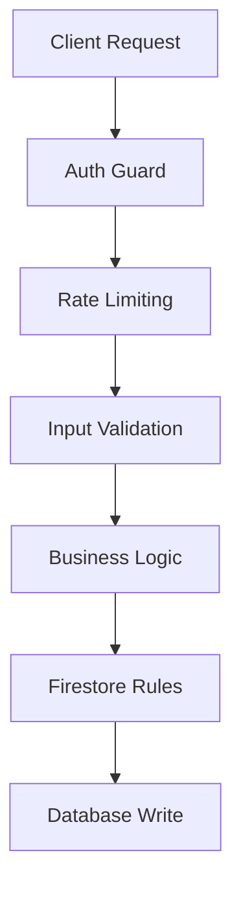
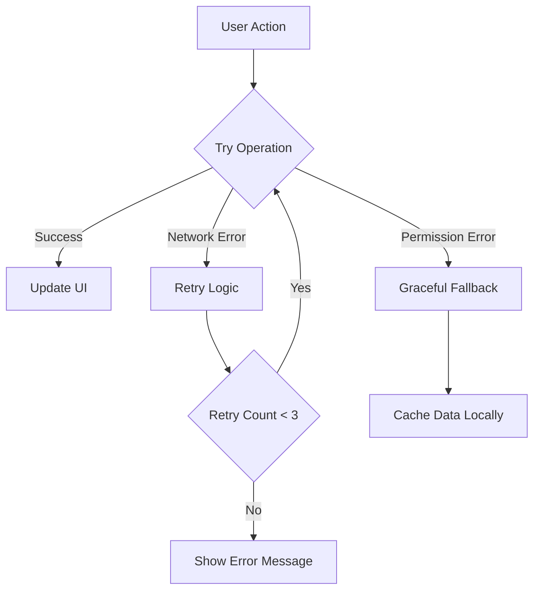
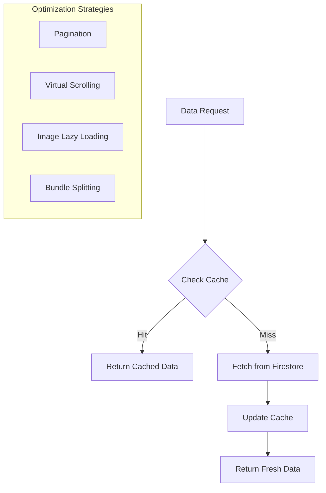
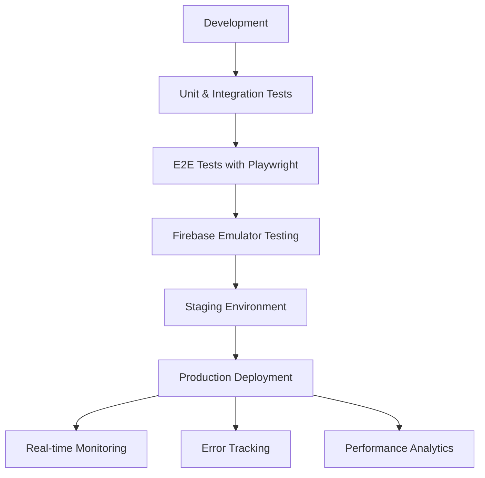

# Connect Hub 2.0: Data Flow & Architecture

This document outlines the logical flow of data and user interactions throughout the Connect Hub application. It serves as an architectural blueprint to verify that the app's components work together as intended.

---

## 1. Core Concepts

- **Firebase Auth**: The single source of truth for user identity. All user-generated content is linked via `userId`.
- **Firestore**: The primary database for all application data. Collections are designed to be queried efficiently.
- **Client-Side Components**: React components (`.tsx` files) are responsible for rendering the UI, capturing user input, and calling server actions/functions.
- **Server Actions / Genkit Flows**: Functions that live on the server (`'use server';`) and are responsible for all backend logic, including database writes and AI interactions. This keeps sensitive logic off the client.

---

## 2. Enhanced Security Layer

This diagram illustrates the ideal security model for handling client requests that modify data. Each request passes through multiple layers of validation and protection.



**Explanation:**
1.  **Auth Guard**: The `layout.tsx` file and server actions verify the user is authenticated with Firebase Auth.
2.  **Rate Limiting**: (Future TODO) A Cloud Function or middleware would prevent abuse by limiting requests per user.
3.  **Input Validation**: Zod schemas on server actions validate the shape and type of incoming data.
4.  **Business Logic**: The server action contains the core logic, ensuring the request is valid.
5.  **Firestore Rules**: Security rules on the database provide the final, non-bypassable check before data is written.
6.  **Database Write**: The action is successfully completed.

---

## 3. Error Handling & Resilience

This diagram outlines the ideal model for creating a resilient user experience, where network issues and other errors are handled gracefully.



**Explanation:**
1.  **Success**: The ideal path where the operation completes and the UI is updated.
2.  **Retry Logic**: For transient issues like a brief network loss, the app can attempt the operation again a few times before showing an error.
3.  **Graceful Fallback**: If an error is definitive (like a permissions issue), the app should handle it gracefully, for example, by disabling a button or using locally cached data if available.
4.  **Error Messaging**: Clear, user-friendly error messages (like the "Toast" notifications used in the app) are crucial for informing the user what went wrong.

---

## 4. Performance Optimization

This diagram outlines strategies to ensure the application remains fast and responsive as it scales.



**Explanation:**
1.  **Caching**: For frequently accessed, non-critical data, a caching layer can reduce direct database reads.
2.  **Pagination**: For long lists like the Social Feed, we should only load a small number of items initially and then load more as the user scrolls. This is a critical next step.
3.  **Virtual Scrolling**: Used for very long lists where rendering all items (even with pagination) would slow down the browser. The Faith Reels page uses a form of this.
4.  **Lazy Loading & Code Splitting**: The Next.js framework automatically handles lazy loading for images (`next/image`) and code splitting by route, which are foundational performance optimizations already in use.

---

## 5. Testing & Monitoring

This diagram outlines the ideal software development lifecycle to ensure application quality and stability from development to production.



**Explanation:**
1.  **Local Testing**: Developers run unit, integration, and end-to-end (E2E) tests locally, often using the Firebase Emulator Suite to simulate the backend.
2.  **Staging Environment**: Code is deployed to a production-like staging environment for final validation before going live.
3.  **Production Deployment**: The code is released to users.
4.  **Post-Deployment**: Once live, the application is continuously watched through monitoring, error tracking (e.g., Sentry, Bugsnag), and performance analytics to catch issues and understand user behavior.

---

## 6. User Authentication & Profile Flow

This is the foundational flow for the entire application.

```mermaid
graph TD
    A[User visits /login or /signup] --> B{Enters credentials};
    B --> C[Firebase Auth validates/creates user];
    C --> D{Auth State Changes};
    D --> E[/app/(main)/layout.tsx listens];
    E --> F{User Profile Check};
    F -->|No Profile or Terms Not Accepted| G[/legal/accept];
    G --> H[User accepts terms];
    H --> I[updateUserProfile() in Firestore];
    I --> J[/dashboard];
    F -->|Profile & Terms OK| J;

    subgraph "Settings Page"
        K[/settings] --> L[User updates profile info];
        L --> M[updateUserProfile() saves to Firestore];
    end
```

**Explanation:**
1.  A new or returning user authenticates via Firebase Auth.
2.  The main app layout (`/app/(main)/layout.tsx`) acts as a guard. It listens for the authentication state.
3.  Once a user is logged in, it checks their Firestore profile for `termsAccepted`.
4.  If terms are not accepted, the user is redirected to the `/legal/accept` page. Accepting the terms updates their Firestore profile.
5.  Once terms are accepted, the user is allowed to proceed to the `/dashboard` and the rest of the app.
6.  The user can update their profile information on the `/settings` page, which directly modifies their document in the `users` collection in Firestore.

---

## 7. Social Feed & Prayer Wall Flow (Content Creation & Display)

This flow is nearly identical for the Social Feed and Prayer Wall and demonstrates the core content loop.

```mermaid
graph TD
    subgraph "User Action (Client)"
        A[User types post/prayer in Textarea] --> B[Clicks "Post"];
        B --> C{Call Server Action};
    end
    
    subgraph "Backend Logic (Server)"
        C --> D[createSocialPost() / createPrayerRequest()];
        D --> E{Prepare Data Object};
        E --> |{userId, name, avatar, content, timestamp}| F[Add document to 'posts' or 'prayerRequests' collection in Firestore];
    end

    subgraph "Display (Real-time)"
        G[/social-feed or /prayer-wall page] -- Listens to --> H[Firestore Collection];
        H -- New data pushed --> G;
        G --> I[UI updates automatically];
    end

    subgraph "Dashboard Integration"
        J[/dashboard page] -- Fetches latest 2-3 items --> H;
        J --> K[Displays snippets with links];
    end
```

**Explanation:**
1.  **Creation**: A user on the `/social-feed` or `/prayer-wall` page writes content and clicks "Post".
2.  **Server Action**: This triggers a server function (`createSocialPost` or `createPrayerRequest`). This function gathers all necessary data (user ID, name, photo, content, current time) and creates a new document in the corresponding Firestore collection.
3.  **Real-time Display**: The feed/wall components use a real-time Firestore listener (`onSnapshot`). When a new document is added to the collection, Firestore automatically pushes the update to all listening clients.
4.  **UI Update**: The React components receive the new data and automatically re-render to display the new post at the top of the list (ordered by timestamp).
5.  **Dashboard Display**: The `/dashboard` page performs a simple, one-time query to fetch the most recent items from these collections to display as previews, linking back to the full pages.

---

## 8. Faith Reels & Sermon Remix Flow (UGC & Creative Tools)

This flow outlines how user-generated video content would be handled.

```mermaid
graph TD
    subgraph "Creation: Sermon Remix"
        A[/sermon-remix page] --> B{User selects sermon / pastes URL};
        B --> C[Video is loaded into editor];
        C --> D{User trims clip & adds effects};
        D --> E[Clicks "Export & Share"];
    end
    
    subgraph "Creation: Faith Reels Upload"
        F[/faith-reels page] --> G{User clicks '+' icon};
        G --> H[Uploads video from device];
    end

    subgraph "Backend Processing (Future TODO)"
        E --> I{Cloud Function Trigger};
        H --> I;
        I --> J[Process Video: transcode, add watermark];
        J --> K[Save processed video to Firebase Storage];
        K --> L[Create document in 'reels' Firestore collection];
        L --> |{reelId, userId, videoUrl, caption, etc.}| M[Data is ready];
    end

    subgraph "Display"
        N[/faith-reels page] -- Fetches data from --> O['reels' collection];
        O --> N;
        N --> P[Displays reels in vertical, scrollable feed];
    end
    
    subgraph "Dashboard Integration"
        Q[/dashboard page] -- Fetches latest reel --> O;
        Q --> R[Displays a thumbnail linking to Faith Reels page];
    end
```

**Explanation:**
1.  **Two Creation Paths**: A user can either create a new reel by remixing an existing sermon or by uploading a video directly.
2.  **Backend Processing (The "Hard Part")**: Both paths would trigger a **Cloud Function** (a future `TODO`). This backend process is crucial: it would take the raw video, process it into a standard format (e.g., MP4, 9:16 aspect ratio), store it in Firebase Storage, and then create a corresponding document in a `reels` Firestore collection with the URL and metadata.
3.  **Display**: The `/faith-reels` page queries the `reels` collection and displays the videos in the TikTok-style scrolling interface.
4.  **Dashboard Integration**: The dashboard would feature a link or a thumbnail of a recent or popular reel to drive engagement back to the Reels page.

---

This map provides a clear overview of how the app's features are interconnected. We can use this as our guide for future development and to ensure the final product is logical, efficient, and aligns with your vision.
